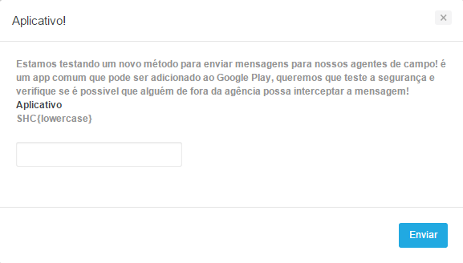
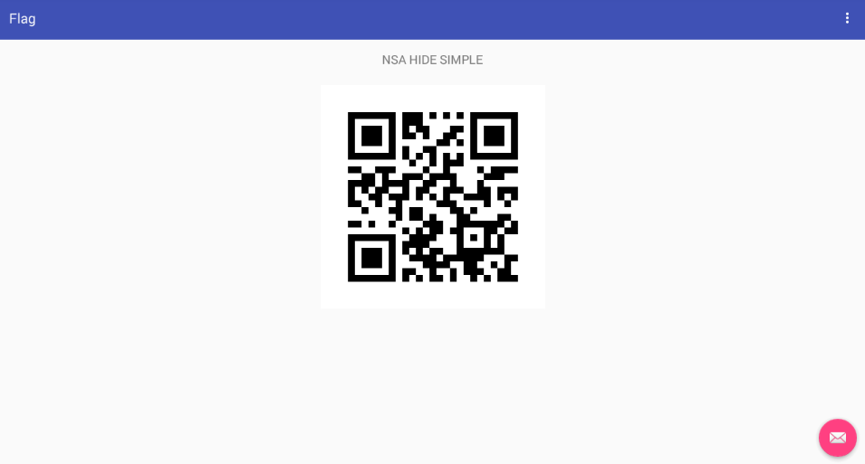
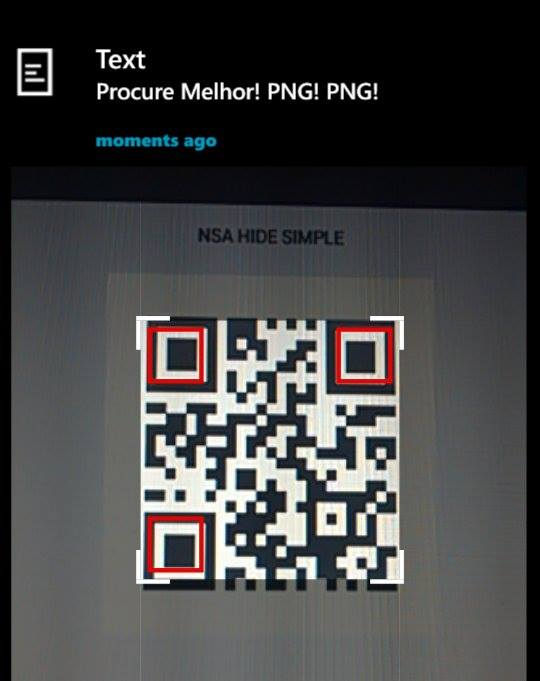
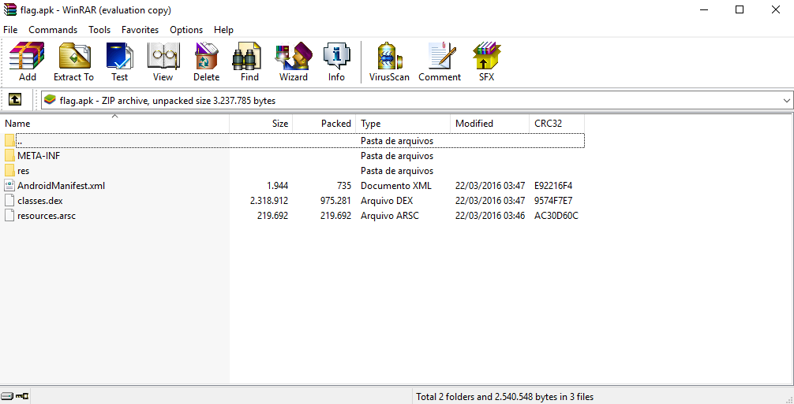
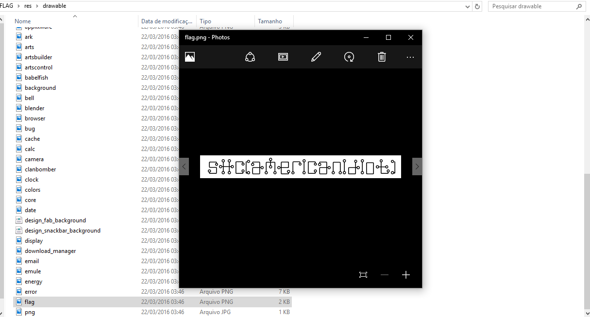
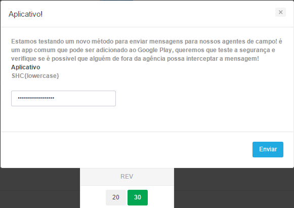

# [AMERICAN IDIOT] - REV-30 (Aplicativo!)

>Estamos testando um novo método para enviar mensagens para nossos agentes de campo! é um app comum que pode ser adicionado ao Google Play, queremos que teste a segurança e verifique se é possivel que alguém de fora da agência possa interceptar a mensagem! 
Aplicativo
SHC{lowercase}


Ao clicar em Aplicativo, ele automaticamente abria uma página com o download de um arquivo ```.apk```, aplicação para android.
O objetivo era testar e quebrar a segurança do aplicativo e encontrar a flag em formato ```SHC{lowercase}``` tal como explicava a dica.
#Instalando apk
Ao instalar o apk em um sistema Android, de cara nos deparamos com um Aplicativo chamado Flag
onde encontrariamos um ```QR Code```.


Ao escanear esse códigodo ele nos retorna uma mensagem
>Procure melhor! PNG! PNG!



#Procure melhor

Você poderia explorar os arquivos do app por meio de um método root no seu android
ou simplesmente abrindo o arquivo .apk com um programa de compactação de arquivos, eu ultilizei o WinRar!



Após isso era só tentar procurar a flag nos arquivos do ```apk```.

Onde encontraria um arquivo denominado flag.


#Flag
Após isso era só entender o que estava escrito na imagem e confirmar a flag e teria a Rev 30 confirmada!
>SHC{americanidiot}




>By:folds


